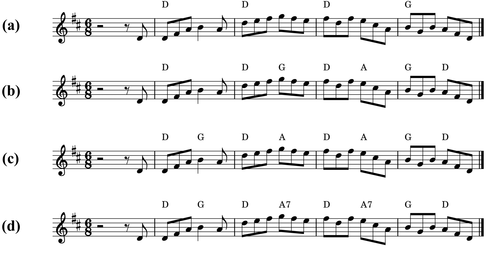
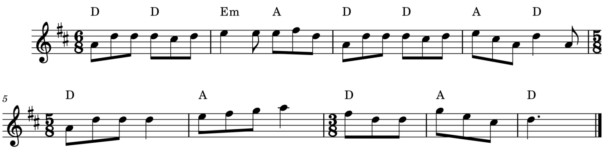
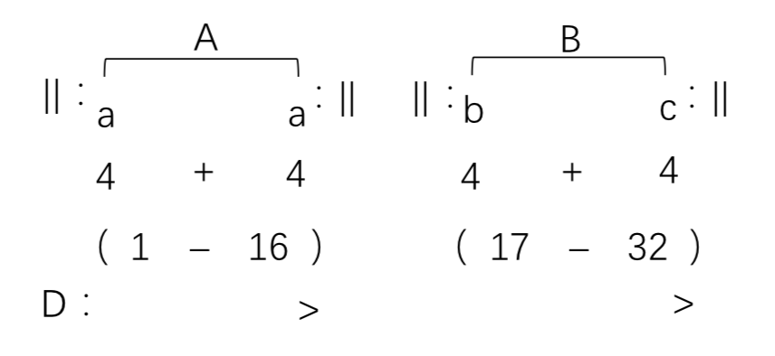

# Analyses
We present several representative examples harmonized by AutoHarmonizer, to illustrate the capabilities of this system.

## Density Sampling Examples
Four examples are given in Fig. 9 to demonstrate intuitively the effect of $d$ on the AutoHarmonizer. As can be seen from these examples, the effect of $d$ on the harmonic rhythm is very significant. In addition, the system does not generate chords in pickup bars, regardless of the setting.

 
Figure 9: The melody harmonization examples of AutoHarmonizer in different settings (Fig. 9a-c for $d=0.1, 0.5, 0.9$ respectively) and the ground truth (Fig. 9d).
 

Fig. 9a is the result of melody harmonization at $d=0.1$. The most obvious feature of this example is that each chord corresponds to a bar. Furthermore, only two types of chords (D major and G major) are included in this example. Although this result is acceptable, it lacks dynamics and variety compared to the other results. 

The example in Fig. 9b is generated with the setting $d=0.5$, which contains chords on the medium-weight beat of the last three bars and introduces a new chord A major.

Fig. 9c is the result generated when $d=0.9$. It places chords on every strong and medium-weak beat. Compared to Fig. 9b, the fourth chord here has changed from G major to A major, although both of them are reasonable.

Fig. 9d is the ground truth. This result is almost the same as Fig. 9c, except that A major is replaced with A7, which is a better choice. Although this difference is trivial for most people, it still means that the system has a gap compared to the human level.

## Complex Time Signatures
To verify the effectiveness of the beat sequence, we tested the melody in Fig. 10, which contains time signatures 5/8 and 3/8 that are not present in the dataset. It is easy to observe that the harmonic rhythms generated by the AutoHarmonizer still conform to the pattern of these time signatures.

 
Figure 10: An example harmonized by AutoHarmonizer ($d=0.9$) with complex time signatures.
 

# 和声分析

Here we give a more detailed analyses in Chinese. 从整体结构来看，此谱例共33小节，调性为D大调，曲式结构为单二部曲式，其前后乐段均有反复，1至16小节为A乐段，17-32小节为B乐段（弱起为0小节），A、B乐段均为方整型乐段，A为平行乐段，B为对比乐段，曲式结构图如下：

**[Rhythm Density = 0.1](pdf/outputs-0.1/jigs51.pdf)**: 此例中，A乐段中第一乐句和声进行为主到下属，第二乐句和声则为主持续；B乐段中第一乐句和声进行为T-DVII-D，以主到属功能进行为主，第二乐句与A段第二乐句一样，同为主持续。就整体的和声进行而言，此例和声进行极为稳定，全曲以主、下属、属功能和声为主；从谱例结构上看，和声进行节奏过于缓慢，缺乏动力，尤其A、B乐段的第二乐句均采用主持续，虽然起到强调和巩固调性的作用，但和声没有进行感；就和声进行的编写而言，其和声进行除导和弦外均使用正三和弦，属于强进行，缺乏一定的过渡感和连贯感，乐段终止处因主持续也缺乏一定的动力，显得较为枯燥。

**[Rhythm Density = 0.5](pdf/outputs-0.5/jigs51.pdf)**: 此例中，A乐段第一乐句和声进行使用正三和弦，和声进行感强烈，第二乐句和声进行为主属进行，乐段停留在完满终止上。B乐段第一乐句和声进行为T-DVII-D7，和声进行以主属功能进行为主，使用属七和弦让和声的整体走向更加平滑连贯。从整体的和声进行来看，此例和声进行稳定，使用七和弦极少，全曲以主、下属、属功能的和声进行为主；从和声进行的节奏来看，A乐段平均每三拍（八分音符为一拍），即半小节切换一次和弦，B乐段平均每小节进行一次和声的进行，和声进行的节奏较为规整适中；从和声的编写角度看，其和声进行主要使用强进行的三和弦，但B段加入的导和弦和属七和弦，使整体进行稍变平缓，增加了一定的连贯性，乐段的终止也不再是枯燥的主持续，而是属功能到主功能的终止进行。

**[Rhythm Density = 0.9](pdf/outputs-0.9/jigs51.pdf)**: 此例中，A乐段第一乐句和声进行使用正三和弦，和声进行感强烈，第二乐句和声进行为主属进行，乐段停留在完满终止上。B乐段第一乐句和声进行为T-DVII-II-D，和声进行时不局限于使用正三和弦，第二乐句则以使用正三和弦进行为主。从整体的和声进行来看，此例和声进行主要使用正三和弦，但B段中使用如二级、七级等副三和弦，此类弱进行使整体使用正三和弦的和声进行更加平滑；从和声进行的节奏角度看，整体平均每三拍（八分音符为一拍），即半小时切换一次和弦，包括在乐段终止处和乐句起始的弱起处，在A段中尤为明显，尽管整体上和声进行的节奏平均但显得过快，且在B段第一乐句中其前两小节和声虽为主持续，但也会按照每半小节一次的和声节奏进行编写，这种情况下和声进行就显得较为笨重且枯燥，浪费了节奏提供的前进感，缺乏动力；从和声的编写角度看，在整体使用正三和弦的强进行的同时，加入了弱进行的副三和弦的使用，其和声进行还是较为连贯且过渡平稳的。

**[Ground Truth](pdf/val/jigs51.pdf)**: 此例中，A乐段第一乐句和声使用正三和弦，功能上主要为主到属功能的进行，动力感很强，但因使用属七和弦，增加了其进行的连贯感，第二乐句和声进行与第一乐句类似，终止为收拢性的完满终止。B乐段第一乐句和声进行为T-DVII，第二乐句和声进行从主到下属进行再由属到主进行构成。从整体的和声进行来看，此例和声整体趋于属主功能的进行，利用下属功能和声过渡增加连贯性，或产生色彩上的对比，因为大量正三和弦的使用，整体和声进行的动力感很强，也因为七和弦的加入，为这种动力感提供了缓冲；从和声进行的节奏角度来看，A乐段的和声节奏为平均每三拍（八分音符为一拍），即半小节切换一次，但在乐段终止处因保证终止式的稳定感则整小节停留在主和弦上，B乐段第一乐句和声进行节奏较缓，每小节切换一次，第二乐句则和A段一样每半小节切换一次，但同样会在终止处平稳停留在主和弦上，这样的进行节奏适中且富有动力；从和声的编写角度来看，此例整体的和声进行为主到属功能进行，但很好地利用了下属功能进行做衔接对比，很好地使用了属七和弦相较于属功能三和弦的中和感，B乐段中更是使用了同主音自然小调的属和弦，和大调中主、属功能的大三和弦形成了色彩上的明显对比，给和声进行增加了一定的色彩饱和感。
