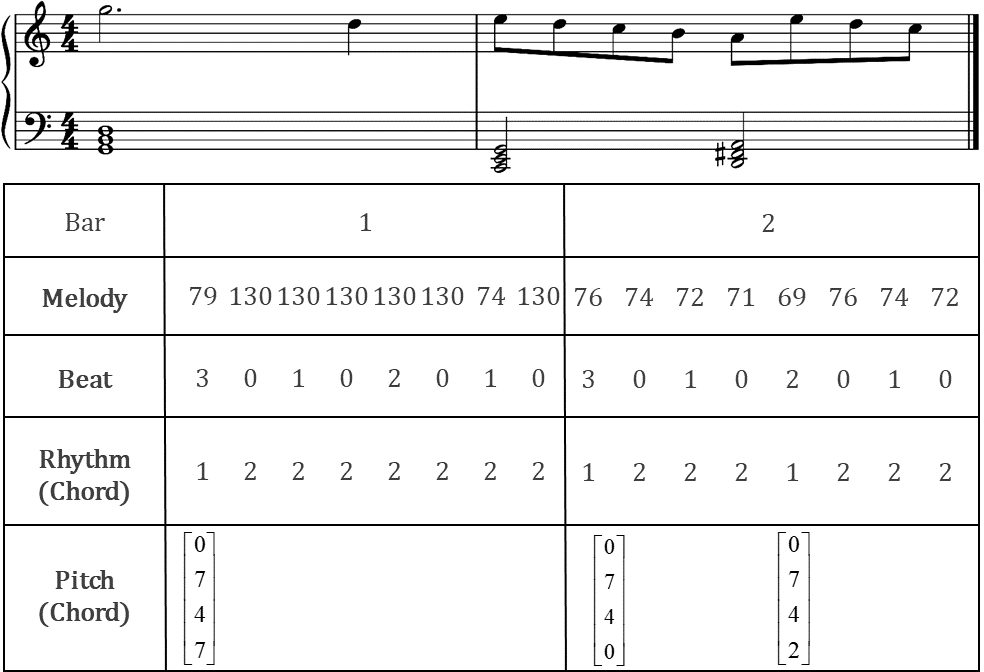
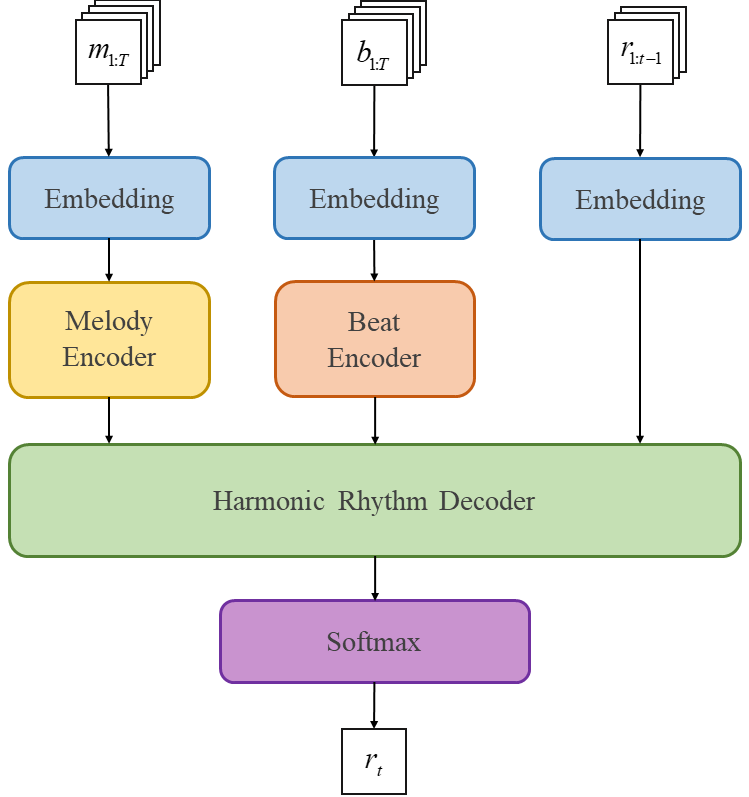
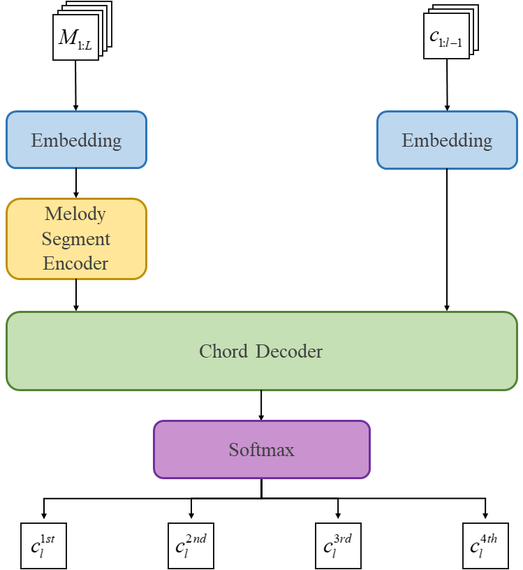
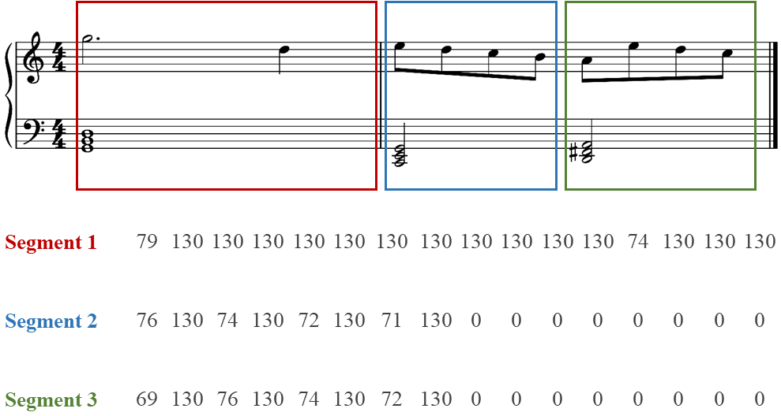
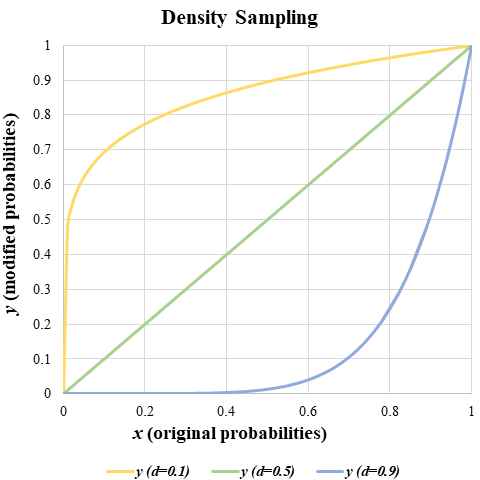

## Encoding Method

The encoding method we use is shown in Fig. 3. Each piece of music is encoded into four sequences as follows.

 

 
Figure 3: A two-bar sample of a melody, beat, rhythm (chord) and pitch (chord) representation. For simplicity, the time resolution in this example is set to eighth notes.
 

**Melody Sequence**: we use 131-dimensional one-hot vectors representing melody, with a time resolution of sixteenth notes. The first 128 dimensions correspond to the 128 different pitches in MIDI. The 129th dimension represents rests, while the 130th dimension represents holds. Finally, the 131st dimension is a special token (for the chord model) used to separate two different melody segments.

**Beat Sequence**: according to the current time signature, we encode the beat information into 4-dimensional one-hot vectors, which correspond to four-beat classes: non-beat, weak, medium-weight and strong beat.

**Harmonic Rhythm Sequence**: the sequence uses one-hot vectors with 3-dimension to represent three different chord's rhythmic states: the rest state, the onset state and the holding state.

**Chord Sequence**: each chord is represented by four 14-dimensional one-hot vectors: the first one-hot vector represents the name of the bass note, the second (third and fourth) represents the number of semitone intervals between the second (third and fourth) note and the bass note. The first 12 dimensions of each one-hot vector represent 12 different types of pitch within an octave, the 13th dimension represents a rest, and the 14th dimension is a special token separating two different chords. When the 13th or 14th dimension of the first vector is activated, the remaining three vectors will be identical to it. For chords containing more than 4 notes, we only encode the first 4 notes in ascending order of pitch.

We find that some melody generation models use similar representations. However, they differ from our representation in that: 1) they represent each chord as a single multi-hot vector, whereas we treat it as four one-hot vectors to predict pitch information more accurately, 2) the rhythm sequence in this paper encodes the rhythm of the chord (i.e. harmonic rhythm) rather than the melody one, and finally 3) their representations do not take into account the importance of time signatures, therefore only supports the most common one (i.e. 4/4).

## Harmonic Rhythm Model

Previous models of melody harmonization always generate chords at a fixed time interval. The harmonic rhythm is not only related to the development of the melody, but depends on the current time signature. Therefore, we proposed a harmonic rhythm model that provides the harmonic rhythmic information of chords while considering time signatures.

As shown in Fig. 4, the harmonic rhythm model mainly consists of three components: a melody encoder, a beat encoder, and a harmonic rhythm decoder. The melody encoder and beat encoder are implemented using Bi-LSTM, and the harmonic rhythm decoder is implemented using LSTM.

 

 

Figure 4: The structure of the harmonic rhythm model

 

Given a melody sequence $m_{1:T}=\{m_{1},m_{2},...m_{T}\}$ of length $T$ and a corresponding beat sequence $b_{1:T}=\{b_{1},b_{2},...b_{T}\}$, this model can generate a harmonic rhythm sequence $r_{1:T}=\{r_{1},r_{2},...r_{T}\}$. When at time step $t\in\{1,2,...,T\}$, it generates the current harmonic rhythm token $r_{t}$, from $m_{1:T}$, $b_{1:T}$, and the previously generated $r_{1:t-1}$:

$$r_{t}=\mathcal M_R(m_{1:T},b_{1:T},r_{1:t-1},\theta_{R}),\tag{1}$$

where $\mathcal M_R$ denotes the harmonic rhythm model and $\theta_{R}$ is its parameter. Since the harmonic rhythm model can refer to melody information $m_{t+1:T}$ and beat information $b_{t+1:T}$ after time step $t$, a longer-term choice is made when generating $r_{t}$. This approach is also consistent with the compositional approach of most composers, just as they usually rely on subsequent melodies as well as time signatures to decide how to arrange the current chord.

## Chord Model

How to represent chords is one of the challenges in melody harmonization. A common approach is to predefine the types of chords. However, it has three disadvantages: 1) it is difficult to cover all possible chords, 2) it cannot generate chords that are not predefined, and 3) it is prone to imbalanced classification.

To solve these problems, we encode each chord $c_i$ as four one-hot vectors $c_i^{1st}$,$c_i^{2nd}$,$c_i^{3rd}$ and $c_i^{4th}$ and ask the chord model to predict the four vectors of the chord $c_i$: the first vector is used to determine the bass of the chord, while the last three vectors are used to determine the structure of the chord. Thus, the model does not need to predefine the types of chords. Moreover, it can generate chords that do not present in the training set.

The structure of the chord model is given in Fig. 5. This model mainly consists of two components, namely the melody segment encoder and the chord decoder. The purpose of this model is to generate a chord sequence $c_{1:L}=\{c_{1},c_{2},...c_{L}\}$ of length $L$ based on a given melody segment sequence $M_{1:L}=\{M_{1},M_{2},...M_{L}\}$.

 

 

Figure 5: The structure of the chord model

 

As shown in Fig. 6, we cut the melody into small segments according to the duration of each chord. Furthermore, we need to make sure that these segments are of equal length to be used as input. Usually, a chord has a duration of up to a whole note, so melodies that are longer than a whole note are truncated, and those that are shorter than a whole note are filled in with padding tokens. Finally, we concatenate these segments by inserting separators (the 131st dimension of the melody vector) between them.

 

 

Figure 6: A segmentation example of a two-bar melody

 

When at time step $l\in\{1,2,...,L\}$, the chord model generates four chord vectors $c_{l}^{1st}$,$c_{l}^{2nd}$,$c_{l}^{3rd}$ and $c_{l}^{4th}$ of the current chord based on $M_{1:L}$ and the previously generated chords $c_{1:l-1}$:

$$c_{l}^{n}=\mathcal M_P(M_{1:L},c_{1:l-1},\theta_{P}),\tag{2}$$

where $\mathcal M_P$ denotes the chord model, $\theta_{P}$ is its parameter and $n\in\{1,2,3,4\}$ is the index of the chord vector. By combining these four outputs for time step $l$, we can get the chord $c_{l}$ at time step $l$.

In addition, unlike the harmonic rhythm model, the chord model has four outputs, thus it also has four corresponding loss values. Since modifying any note in the chord will change the nature of it, we do not set weights for the four loss values.

## Density Sampling

In general, modern language models require not only a lot of efforts from researchers to design a structure for controllable generation, but a large amount of annotated data for training. However, in certain generation tasks, some of the properties of the generated sequences are strongly correlated with specific tokens. For example, the holding token is highly correlated with the rhythmic property of music. Therefore, we can achieve controllable generation by adjusting how often they appear in a sequence. Not only is it easy to introduce prior knowledge into the sampling process, but there is no need to redesign the structure or retrain the model with annotated data. 

To achieve the harmonic rhythm-controllable melody harmonization task, we use a tangent function according to the parameter density $d\in$(0,1), to modify the log probability of the holding token: the lower the value of $d$, the fewer chords will be generated, and vice versa. The basic idea of this method is to increase or decrease the probability of a given token by the given $d$, which can be formulated as follows:

$$p_{h}^{*}=p_{h}^{tan(\frac{\pi d}{2})},{\quad}{\,}p_{i}^{*}=(p_{h}-p_{h}^{*}) \cdot \frac{p_{i}}{\sum p_{\backslash h}}+p_{i},\tag{3}$$

where $p_h$ and $p_h^\*$ are the original and the new probability of the holding token, while $p_{i}$ and $p_{i}^{*}$ are the original and the new probabilities of non-holding tokens ($i\in \backslash h$). The first step in Eq. 3 is to change the probability of the holding token, and the second step is to ensure that the sum of the probabilities of all tokens is equal to 1. As shown in Fig. 7, when $d<0.5$, the probability of the holding token is increased, and when $d>0.5$, the probability of the holding token is decreased. Particularly, when $d=0.5$, the probabilities of all tokens do not change.

 

 
Figure 7: Graphic representation of how density sampling changes the probability of the specified token.
 

As this specified token is the holding token in this implementation, $d$ can be used to control the sparsity of the chord progression. Furthermore, this method is not limited to controlling rhythm density. For example, in a music generation task, if we know which token represents the tonic, we can use density sampling to control the probability of the tonic token and achieve a controllable generation of tonality. More generally, density sampling can be applied to any language model for controllable generation based on modifying the probability of a specified token.
