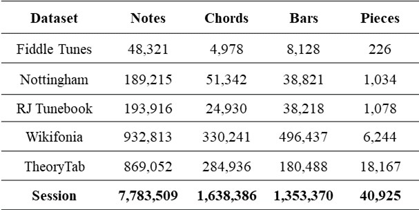
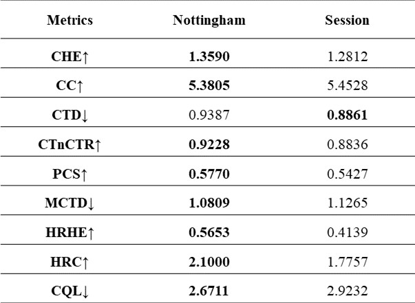

# Dataset Harmonized by AutoHarmonizer

Symbolic music datasets are important for both music information retrieval and music generation. However, there is a lack of large-scale lead sheet symbolic music datasets. Therefore, we create a lead sheet dataset based on Session Dataset, named as the Session Lead Sheet Dataset (SLSD), containing 40,925 tunes with chords. 

This dataset is collected as follows. We first download all the tunes in ABC format from the Session, a community website dedicated to Irish traditional music. We then convert those ABC files to MusicXML with the music21 toolkit. However, the conversion is not entirely accurate (e.g., extra rests are added at the end of pickup bars). Therefore, we clean the converted files and remove the repeat notation by flattening each score to make them more machine-readable. Finally, we use AutoHarmonizer (d=0.5) to generate the corresponding harmonies for these Irish traditional tunes. Each harmonized piece contains melody and corresponding chord progression, and metadata information such as key signature, time signature, title and genre.

Table 3: Comparison of some existing public lead sheetdatasets and the proposed dataset.
 

 

To the best of our knowledge, SLSD is the largest lead sheet MusicXML dataset so far. Table 3 shows the number of notes, chords, bars and pieces of different datasets. In addition, as we cannot read the original TTD directly, we use its MIDI version for statistical information other than chords (the MIDI version does not contain chords), which is instead obtained by counting the number of occurrences of the keyword "<chord>" in those XML files. Therefore, the statistical results in this dataset are for information purposes only and are not guaranteed to be accurate.

Table 4: The results comparison of NLSD and SLSD in various metrics.

 

The SLSD can be used but not limited to the following research topics including: 1) harmonic study, 2) ethnomusicological study, 3) melody harmonization and 4) melody generation based on chords. Although the chords are machine-generated, the AutoHarmonizer is closer to human-composed chord progressions than other melody harmonization systems, as it takes into account harmonic rhythms. In addition, given that Ireland and Britain share a very similar cultural background, using the AutoHarmonizer trained on NLSD to produce the chord progressions for the Session Dataset would be more in keeping with its melodic style. For intuitive comparison, Table 4 gives the results of NLSD and SLSD in each metric. We suggest using this dataset for pre-training and later fine-tuning on a dataset like NLSD to further improve the performance of deep learning models.
