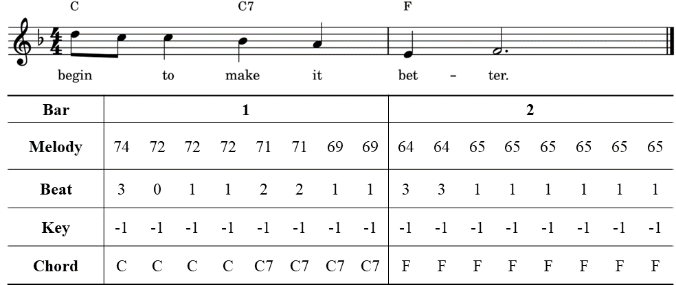

Melody harmonization, namely generating a chord progression for a user-given melody, remains a challenging task to this day. Although previous neural network-based systems can effectively generate an appropriate chord progression for a melody, few studies focus on controllable melody harmonization, and none of them can generate flexible harmonic rhythms. To achieve harmonic rhythm-controllable melody harmonization, we propose AutoHarmonizer, a neural network-based melody harmonization system that can generate denser or sparser chord progressions with the use of a new sampling method for controllable generation proposed in this paper. This system mainly consists of two parts: a harmonic rhythm model provides coarse-grained chord onset information, while a chord model generates specific pitches for chords based on the given melody and the corresponding harmonic rhythm sequence previously generated. To evaluate the performance of AutoHarmonizer, we use nine metrics to compare the chord progressions from humans, the system proposed in this paper and the baseline. Experimental results show that AutoHarmonizer not only generates harmonic rhythms comparable to the human level, but generates chords with overall better quality than baseline at different settings. In addition, we use AutoHarmonizer to harmonize the Session Dataset (which were originally chordless), and ended with 40,925 traditional Irish folk songs with harmonies, named the Session Lead Sheet Dataset, which is the largest lead sheet dataset to date.

 

 

Figure 1: The overall framework of AutoHarmonizer

 

We proposed a harmonic rhythm-controllable melody harmonization system, AutoHarmonizer, that consists of a harmonic rhythm model and a chord model. Fig. 1 shows how AutoHarmonizer generates a chord sequence based on a given melody. It first extracts two types of meta-information from the lead sheet, namely the time signature and the key signature, and uses them to create the beat sequence $b_{1:T}$ and to transpose the melody to C-major/A-minor, respectively. The transposed melody is then quantize and encode into a melody sequence $m_{1:T}$ of length $T$, which is fed into the harmonic rhythm model along with the beat sequence $b_{1:T}$. After that, we can get a harmonic rhythm sequence $r_{1:T}$ generated by this model. AutoHarmonizer then cuts the melody sequence $m_{1:T}$ according to harmonic rhythm sequence $r_{1:T}$ to obtain the melody segment sequence $M_{1:L}$ of length $L$, and feeds it to the chord model to get the chord sequence $c_{1:L}$. Finally, the system decodes the chord progression from the chord sequence $c_{1:L}$ and the harmonic rhythm sequence $r_{1:T}$, and transposes it back to the original key signature.

For more information, see our paper: [arXiv paper](https://arxiv.org/abs/2112.11122).  
