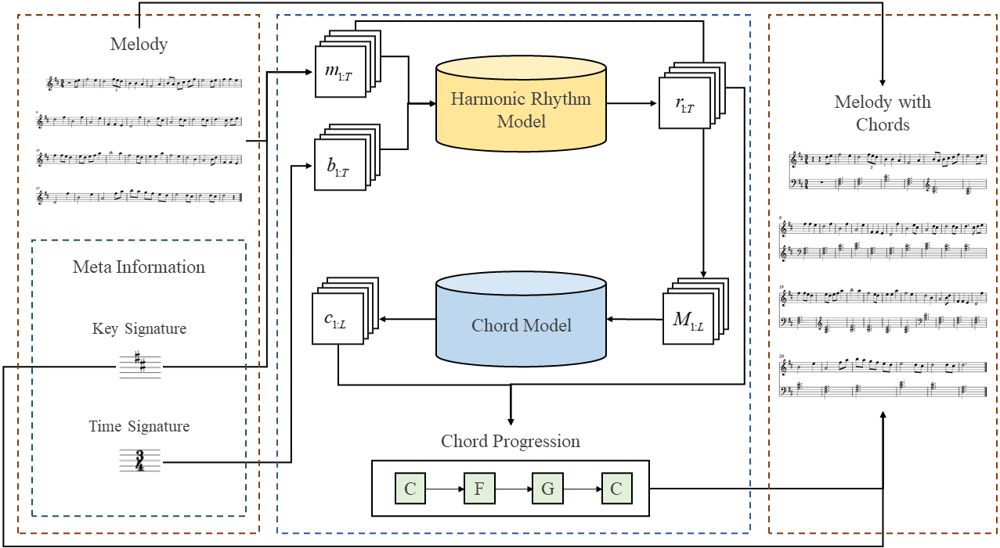
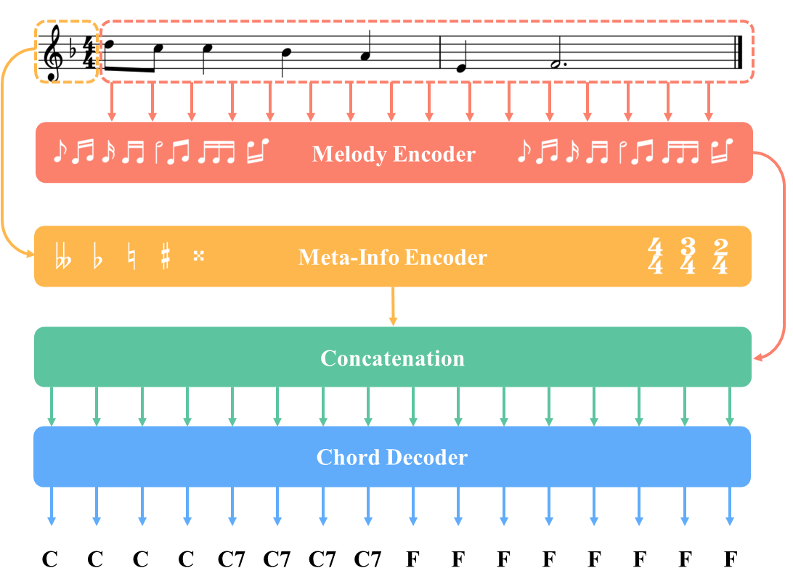

## Data Representation

Our data representation takes into account two pieces of meta-information from sheet music, namely the time signature and the key signature. As shown in Fig. 1, each lead sheet is encoded into four sequences of the same length.

 

 
Figure 1: A two-bar sample of a melody, beat, key, and chord representation (at a time resolution of eighth notes).
 

**Melody Sequence**: we use 128-dimensional one-hot vector to represent each frame, with a time resolution of sixteenth notes. The first dimension represents rests, while the remaining dimensions correspond to the 127 different pitches in MIDI (except 0).

**Beat Sequence**: a sequence of 4-dimensional vectors based on time signatures. It represents the beat strength of frames in the melody sequence. Its values range from 0 to 3, corresponding to four categories: non-beat, weak, medium-weight, and strong beat.

**Key Sequence**: the keys are encoded according to their number of sharps, with flats corresponding to $-7$ to $-1$, no flat/sharp corresponding to 0, and sharps corresponding to 1 to 7, for a total of 15 types.

**Chord Sequence**: each chord is encoded as a one-hot vector: the first dimension represents rests, while the others correspond to 1,461 chord symbols.

## Network Architecture

In real musical practice, it is first necessary to consider what the notes of the  current melody segment are when matching a melody to a chord progression. Generally (though not always), chords containing notes from the melody are preferred (e.g., chord tones). However, sometimes there is more than one chord that matches the current notes, thus the next chord needs to be decided based on the following melody notes.

For the above reason, we chose Bi-LSTM as the backbone network for AutoHarmonizer, enabling it to capture music information in both directions. As shown in Fig. 2, AutoHarmonizer is based on an encoder-decoder architecture. The input of the melody encoder is a melody sequence, while for the meta-info encoder it is a concatenated sequence of beat and key sequences. Both of them consist of two stacked blocks, which consist of a Bi-LSTM layer with 256 units and a time-distributed layer with 128 units. We then concatenated the last hidden states of these two encoders and fed them into the decoder. The decoder contains 3 stacked layers, and the output layer has 1,462 units corresponding to 1,462 chord types. It autoregressively generates the chord symbols frame-by-frame (sixteenth note). We empirically chose the dropout with a rate of 0.2, a batch size of 512, and early stopping for 20 epochs of patience.

 

 

Figure 2: The architecture of AutoHarmonizer, which predicts chord symbols frame-by-frame (sixteenth note).

 

## Controllable Harmonic Density

Based on the assumption that some attributes of the generated text are closely related to the number of occurrences of some tokens, Wu et al. proposed [gamma sampling](https://arxiv.org/pdf/2205.06036.pdf) for controlling language models. It achieved controllable text generation by scaling the probability $p$ of the attribute-related token during generation time:

$$p^{\mathcal{A}}_{out}=p_{in}^{\mathcal{A}tan(\frac{\pi \Gamma}{2})}, \\ p^{a}_{out}=p^{a}_{in}\cdot \frac{p^{\mathcal{A}}_{out}}{p^{\mathcal{A}}_{in}},\quad \forall a\in \mathcal{A}, \\ p^{n}_{out}=p^{n}_{in} \cdot (1 + \frac{p^{\mathcal{A}}_{in}-p^{\mathcal{A}}_{out}}{p^{\backslash \mathcal{A}}_{in}}),\quad \forall n\notin \mathcal{A},$$

where $\Gamma\in$[0,1] is the user-controllable parameter, $p_{in/out}$ is the input/output probability, $\mathcal{A}$ is the set of attribute-related tokens and $p^{\mathcal{A}}$ is the sum of their probabilities, while $p^{\backslash \mathcal{A}}$ is the sum of the probabilities of tokens that are not in $\mathcal{A}$. When $\Gamma=0.5$, there is no change in the probability distribution, while when $\Gamma<0.5$, the probabilities of the attribute-related tokens increase and vice versa.

To achieve controllable harmonic density, when generating the chord $c_{t}$ at time step $t$, we select the previously generated chord token $c_{t-1}$ as the attribute-related token. When $\Gamma>0.5$, AutoHarmonizer tends to generate chords different from $c_{t-1}$, thus the switching of chords becomes more frequent, making it tend to generate denser chord progressions, and vice versa.  

In most cases, the output probability is high for essential chords (i.e., tonic, dominant, and subdominant chords) and low for non-essential chords. Depressing the frequency of chord switching makes it likely to omit non-essential chords, and vice versa, generating more non-essential chords.
