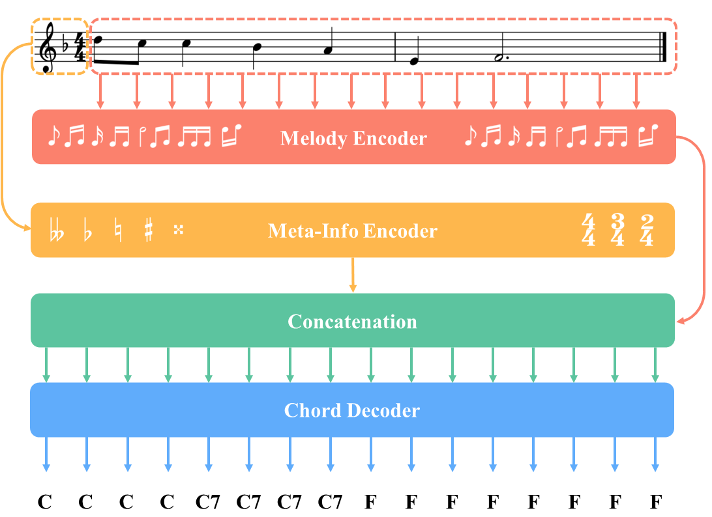

In real musical practice, it is first necessary to consider what the notes of the  current melody segment are when matching a melody to a chord progression. Generally (though not always), chords containing notes from the melody are preferred (e.g., chord tones). However, sometimes there is more than one chord that matches the current notes, thus the next chord needs to be decided based on the following melody notes.

For the above reason, we chose Bi-LSTM as the backbone network for AutoHarmonizer, enabling it to capture music information in both directions. As shown in Fig. 2, AutoHarmonizer is based on an encoder-decoder architecture. The input of the melody encoder is a melody sequence, while for the meta-info encoder it is a concatenated sequence of beat and key sequences. Both of them consist of two stacked blocks, which consist of a Bi-LSTM layer with 256 units and a time-distributed layer with 128 units. We then concatenated the last hidden states of these two encoders and fed them into the decoder. The decoder contains 3 stacked layers, and the output layer has 1,462 units corresponding to 1,462 chord types. It autoregressively generates the chord symbols frame-by-frame (sixteenth note). We empirically chose the dropout with a rate of 0.2, a batch size of 512, and early stopping for 20 epochs of patience.

 

 

Figure 2: The architecture of AutoHarmonizer, which predicts chord symbols frame-by-frame (sixteenth note).

 
